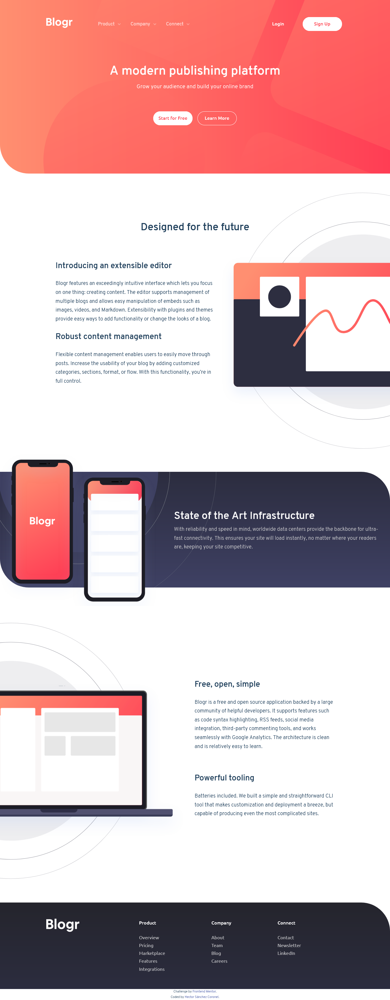

# BlogLandingPage
 Landing Page for a Blog - from FrontendMentor
 
 # Frontend Mentor - Blogr landing page solution

This is a solution to the [Blogr landing page challenge on Frontend Mentor](https://www.frontendmentor.io/challenges/blogr-landing-page-EX2RLAApP). Frontend Mentor challenges help you improve your coding skills by building realistic projects. 

## Table of contents

- [Overview](#overview)
  - [The challenge](#the-challenge)
  - [Screenshot](#screenshot)
  - [Links](#links)
- [My process](#my-process)
  - [Built with](#built-with)
  - [What I learned](#what-i-learned)
  - [Continued development](#continued-development)
  - [Useful resources](#useful-resources)
- [Author](#author)
- [Acknowledgments](#acknowledgments)

**Note: Delete this note and update the table of contents based on what sections you keep.**

## Overview

### The challenge

Users should be able to:

- View the optimal layout for the site depending on their device's screen size
- See hover states for all interactive elements on the page

### Screenshot




### Links

- Solution URL: [Add solution URL here](https://github.com/encoreOax/Blog-landing-page)
- Live Site URL: [Add live URL here](https://blog-landing-page-three.vercel.app/)

## My process

### Built with

- Semantic HTML5 markup
- CSS custom properties
- Flexbox
- Mobile-first workflow
- Vanilla JS 

### What I learned

For me this was a complicated project, since it had several elements that I had not developed before. The solutions that I was able to develop are adapted to what is requested, but I believe that I still have several areas of opportunity to continue improving.
The time invested in this project was 12 hours, and I think it's too much for such a small project, my personal goal is to achieve similar projects in 2 hours.

One of the biggest challenges for me in meeting the specs was the mobile menu.
Initially I tried to use the same navigation panel for mobile and desktop, but in the end I decided to develop two independent panels. I'm not sure how good practice that is.

I only used flex-box and I belive Grid would be more suitable in some cases. 

I used only the files that were provided, and not use any otherto build the site. This was a challenge, specialy in the "hamburger" menu for the mobile version, but I made it work. This is the mobile menu:

```html
<nav id="nav" class="flex _column  nav vis-hidden">

        <ul class="flex_column _just-c-sb _wh-max ">
          <li class="list">
            <a class="sub-menu-btn ">Product<span class="nav_icon "></span></a>
            <ul class="sub-menu">
              <li><a href="#">Overview</a></li>
              <li><a href="#">Pricing</a></li>
             
```
```css
.nav {
    width: 20.25rem;
    position: absolute;
    top: 6.8rem;
    left: 0;
    right: 0;
    margin-left: auto;
    margin-right: auto;
    font-weight: var(--font-ubuntu-bold);
    color: var(--primary-very-dark-blue-headings);
    background-color: white;
    border-radius:calc(var(--border-radius)/10) ; 
    box-shadow: 0rem 3rem 6rem -2rem var(--neutral-very-dark-black-blue-footer-background);  
}
.nav li {
    margin-top: var(--margin-nav-li);
}

.list:last-of-type {
    margin-bottom: var(--margin-nav-li);
}

.nav a:last-of-type {
    margin-bottom: var(--margin-nav);
}

.sub-menu {
    background-color: var(--neutral-grayish-blue-transparent);
    margin-top: var(--padding-nav);
    margin-right: var(--padding-container);
    margin-left: var(--padding-container);
    margin-bottom: var(--padding-nav);
    padding-top: 0.1rem;
    padding-bottom: var(--padding-nav);
    border-radius:calc(var(--border-radius)/20) ;
    color: var(--neutral-very-dark-grayish-blue-body-copy);
    display: none;
}

.nav_icon{
    margin-left: 1ch;
    width: 1.05ch;
    height: 0.7ch;
    display: inline-block;
    background-image: url(/images/icon-arrow-dark.svg);
    background-repeat: no-repeat;
    background-size: cover;
}

.nav_icon-open {
    margin-left: 1ch;
    width: 1.05ch;
    height: 0.7ch;
    display: inline-block;
    background-image: url(/images/icon-arrow-dark.svg);
    background-repeat: no-repeat;
    background-size: cover;
    transform: rotate(180deg);
}
```
```js
const btnHam = document.getElementById('ham')
const navMobile = document.getElementById('nav')

btnHam.addEventListener('click', ()=>{

    if (btnHam.classList.contains('ham-on')){
        btnHam.classList.remove('ham-on')
        btnHam.classList.add('ham-off')
        navMobile.classList.remove('vis-hidden')
        navMobile.classList.add('vis-visible')
    }else {
        btnHam.classList.remove('ham-off')
        btnHam.classList.add('ham-on')
        navMobile.classList.remove('vis-visible')
        navMobile.classList.add('vis-hidden')
        
    }
})
```
Im sure that it can be improved and I will work on a bether version, but maybe for other proyect.

Ironically, one of the things that cost me the most was the background of the hero image, since I wanted it to stay in the same position for all versions, that took more time than I would have liked. But in the end, I achieved something that seems acceptable to me. This is the code:
```html
   <header class="flex _column" id="inicio">

      <div class="container top">

        .............

          </div>
        </div>
        <div class="hero-bg"></div>

      </div>           
```
```css
.top {
    position: relative;
    width: 100%;
    height: 45.5rem;
    background: 
    linear-gradient(to bottom, 
    var(--gradient-mobile-nav-very-light-red), 
    var(--gradient-mobile-nav-light-red)  
    );
    border-end-start-radius: var(--border-radius);
    overflow: hidden;   
    color: var(--neutral-white-text);
    z-index: 0; 
}
.hero-bg {
    position: absolute;
    background-image: url(/images/bg-pattern-intro.svg);
    background-repeat: no-repeat;
    background-size: contain;
   
    width: 93.75rem;
    height: 182.7rem;
    top: -13.7025rem;
    left: -26.953125rem;
    opacity: 0.7;
    z-index: -1;
}
```
I believe that there is a more efficiet way to achieve the same result, and I am tasked with coming up with a better solution.

### Continued development

One of the most important points for improvement is my use of JS, since in this project it was very limited and I think it could have been better.

### Useful resources

- [Resource 1](https://gomakethings.com/how-to-show-and-hide-elements-with-vanilla-javascript/) - This helped me to refresh my knowledge in JS.
- [Resource 2](https://youtu.be/aoQ6S1a32j8) - Again, this video was very helpfull, seeing her solving similar problems to my own helps a lot!
- [Resource 3](https://youtu.be/_1vEGYWaaQY) - Kevin Powell is great for neat CSS, I use this trick for the underline in the footer.


## Author

- Website - [Hector Enrique Sánchez Coronel](https://github.com/encoreOax)
- Frontend Mentor - [@encoreOax](https://www.frontendmentor.io/profile/encoreOax)
- Twitter - [@HectorCoronel81](https://www.twitter.com/HectorCoronel81)


**Note: Delete this note and add/remove/edit lines above based on what links you'd like to share.**

## Acknowledgments

When I took this challenge I feel that it will take me only 3 to 4 hours, the fact that it was harder than I thought tells me that I'm far from the point I want to be, I will work more and solve more challenges to improve on my code!
